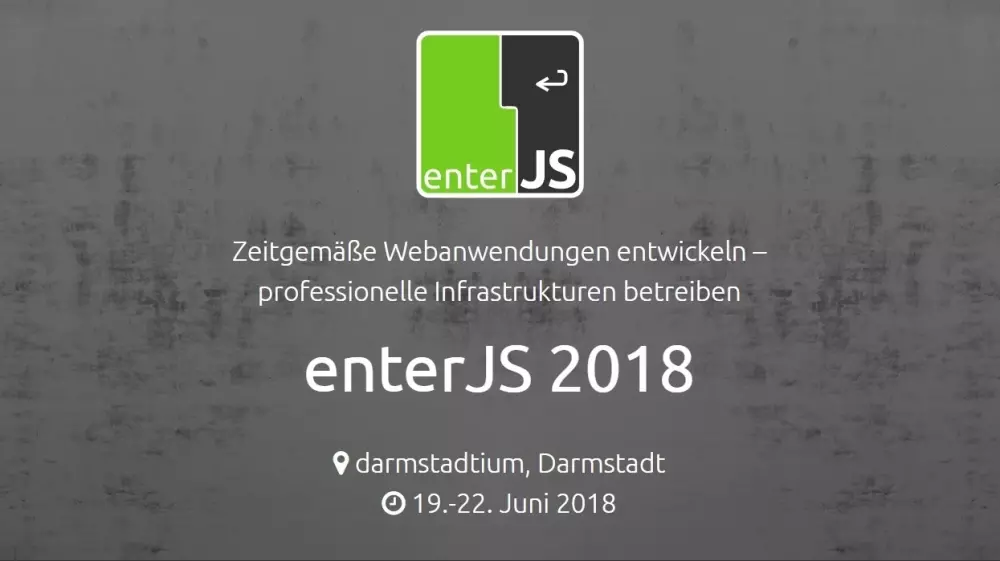

# Reaktive Programmierung mit RxJS
#### **von Johannes Hoppe und Ferdinand Malcher**

<hr>

**Schön, dass Du dabei bist!**  
Merke dir schon einmal dieses Repository.  
Hier wird während des Workshops stets der Quelltext mit unseren Beispielen verfügbar sein.
> **https://github.com/angular-schule/2018-06-rxjs-workshop-enterjs**

Damit wir gleich durchstarten können, solltest Du ein paar Vorbereitungen treffen.  
Die gesamte Installation wird nicht mehr als 30 Minuten dauern. 


## Benötigte Software

1. Node.js **8.9 oder höher**: [https://nodejs.org](https://nodejs.org)
2. Visual Studio Code: [https://code.visualstudio.com](https://code.visualstudio.com)
    * empfohlen: [Angular-Schule: Extension Pack](https://marketplace.visualstudio.com/items?itemName=angular-schule.angular-schule-extension-pack) für Visual Studio Code 
3. Google Chrome: [https://www.google.com/chrome/](https://www.google.com/chrome/)
  

## Proxy?

__Vor der enterJS__
Sollte auf Deinem Firmenrechner der Internetzugang durch einen Proxy realisiert sein, müssen wir noch einige Einstellungen setzen.
Wir haben dir hierfür folgende Anleitung erstellt: https://presentations.angular.schule/PROXY.html

__Während der enterJS__
Solltest du dann im WLAN der Veranstaltung sein UND eine VPN-Lösung verwenden, so behalte die Proxy-Einstellungen bei.
Ansonsten entferne die Proxy-Einstellungen wieder.


## Pakete installieren

Wir benötigen zwei Pakete, die über NPM installiert werden.

* `ts-node`: TypeScript-Umgebung für Node.js
* `@angular/cli`: CLI-Tool für Angular

Dazu führe bitte den folgenden Befehl auf der Kommandozeile aus:

```bash
npm i -g ts-node @angular/cli
```

Nach der Installation sollten die Befehle `ts-node` und `ng` global in der Kommandozeile verfügbar sein:

```
> ts-node -v

ts-node v6.1.0
node v8.11.2
typescript v2.7.1
cache "/var/folders/x9/t7ysrv6925b8qv6gv3b2yk1w0000gn"


> ng -v

Angular CLI: 6.0.8
Node: 8.11.2
```

Alle weiteren Pakete installieren wir gemeinsam vor Ort.

-----

Sollte es Probleme geben oder zu einer Fehlermeldung kommen, dann sende uns den Fehlertext einfach per Mail an [team@angular.schule](mailto:team@angular.schule).  
Wir werden schnell eine Lösung finden.


### Wir freuen uns schon! 🙂

Bei Fragen wende dich einfach direkt an das Angular-Schule-Team:  
[team@angular.schule](mailto:team@angular.schule)

Beste Grüße<br>
**Johannes** und **Ferdinand**

<hr>


#### &copy; 2018 https://angular.schule, Stand: 13.06.2018

